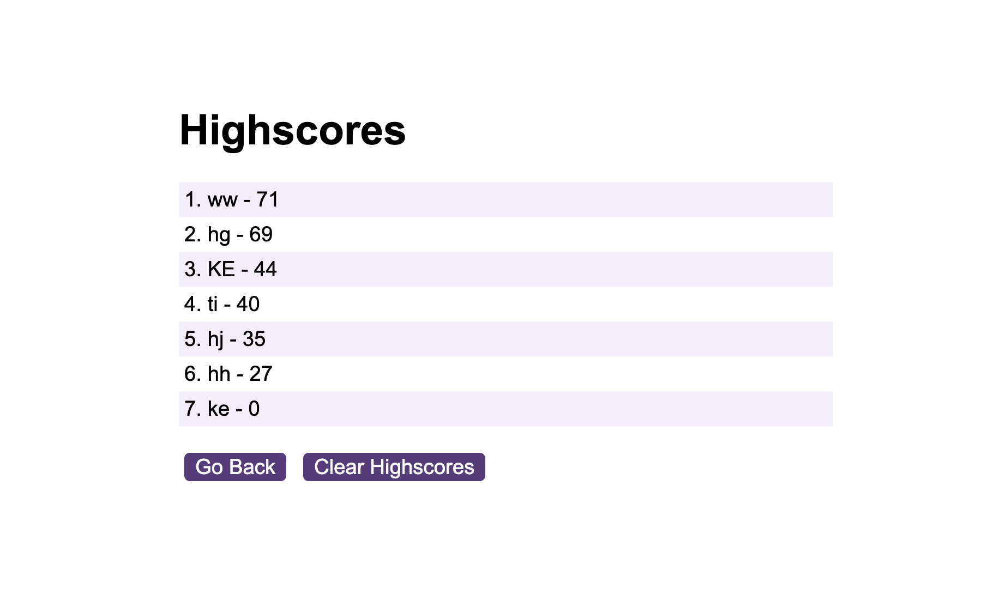

# TimedQuiz

## Project Description
This project is timed quiz with questions related to Javascript. The timer starts to countdown once the user starts the quiz and will deduct 15 seconds from the time clock when the user answers a questuion wrong. At the end of the quiz the users final time becomes their score and the user can submit their scores to the highscores array, stored in local storage.

## Usage
Project link: https://kekwulugo.github.io/TimedQuiz/

## Installation
You can copy the files in this respository and run the program directly in the browser with a sleek and simple user interface

## Technology Used
HTML, CSS, and JavaScript

## Credits
Starter Code Courtesty of Edward Apostol and the Skill Hat DTTP Web Development Program 2024
